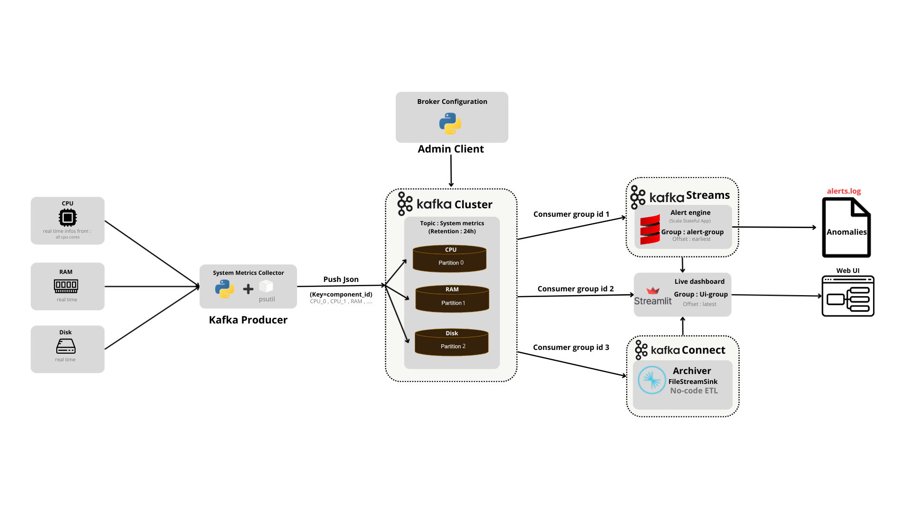

# 🛡️ Sentinel - Real-time System Monitoring

Sentinel est une solution de monitoring système temps réel basée sur **Apache Kafka**. Elle collecte des métriques système (CPU, RAM, Disque) via Python, les traite via un Consumer Scala (Kafka Streams), et archive les alertes critiques via Kafka Connect.

## 🎥 Démo du Dashboard

[Voir la vidéo de démonstration](assets/kakfa_showcase.mp4)

## 🏗️ Architecture

Cette architecture met en œuvre les concepts de **Producer**, **Consumer Groups**, **Kafka Streams** et **Kafka Connect** pour créer un pipeline de données robuste et scalable.



### Flux de données :
1.  **System Metrics Collector (Producer Python)** : Utilise `psutil` pour collecter les métriques (CPU, RAM, Disk) et les publie sur le topic `system_metrics` (partitionné par type de ressource).
2.  **Infrastructure Kafka** : Cluster Kafka gérant la distribution et la rétention des messages (24h).
3.  **Alert Engine (Kafka Streams / Scala)** : Consomme les métriques en temps réel (`group-id: alert-group`), applique des fenêtres de temps pour analyser les tendances, et produit des alertes sur le topic `system_alerts` en cas de dépassement de seuil.
4.  **Live Dashboard (Consumer Python / Streamlit)** : Consomme les données en temps réel (`group-id: ui-group`) pour les visualiser sur une interface web interactive.
5.  **Archiver (Kafka Connect)** : Sink Connector qui écoute le topic `system_alerts` et sauvegarde automatiquement les anomalies dans des fichiers logs pour audit ultérieur.

## Prérequis

*   **Kafka** (v3.x ou 4.x) & Zookeeper (ou KRaft)
*   **Python** 3.8+
*   **SBT** (Scala Build Tool) & **Java** 17+

## Installation & Démarrage

### 1. Démarrer l'infrastructure Kafka
Assurez-vous que Zookeeper et Kafka Broker sont lancés. Créez les topics nécessaires (si non créés automatiquement) :
```bash
kafka-topics.sh --create --topic system_metrics --bootstrap-server localhost:9092
kafka-topics.sh --create --topic system_alerts --bootstrap-server localhost:9092
```

### 2. Configuration Python (Producer & Dashboard)
Créez un environnement virtuel et installez les dépendances :
```bash
python3 -m venv .venv
source .venv/bin/activate
pip install -r requirements.txt
```

Lancer le producteur de métriques :
```bash
python3 src/producer.py
```

Lancer le Dashboard :
```bash
streamlit run dashboard/app.py
```

### 3. Configuration Scala (Stream Processor)
Compilez et lancez le processeur d'alertes :
```bash
sbt "runMain sentinel.AlertSystem"
```

### 4. Configuration Kafka Connect (Archivage)
Pour sauvegarder les alertes dans un fichier (`tmp/alerts.log`).

1.  Assurez-vous que les plugins nécessaires sont dans le dossier `plugins/`.
2.  Lancer le connecteur en mode standalone :
```bash
<path-to-kafka>/bin/connect-standalone.sh config/connect-standalone.properties config/alerts-sink.properties
```

## Structure du Projet

```
Sentinel/
├── assets/                  # Images d'architecture et démos
├── config/                  # Configurations Kafka Connect (.properties)
├── dashboard/               # Application Streamlit
│   └── app.py
├── plugins/                 # Dossier pour les JARs Kafka Connect (exclus du git)
├── src/                     # Code source
│   ├── producer.py          # Script Python de collecte
│   ├── admin_create.py      # Script admin Kafka
│   └── main/scala/          # AlertSystem.scala (Kafka Consumer)
├── tmp/                     # Dossier de destination des logs (exclus du git)
├── build.sbt                # Définition du projet Scala
└── README.md
```
